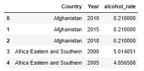
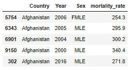
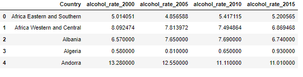
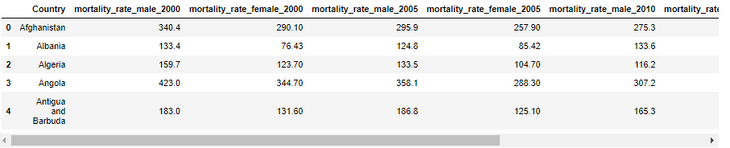
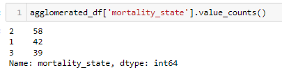

# 💀  Mortality_Predictor

## 🚧 Project Information by Parts

### ETL Methodology

#### Data Files and Sources
* Mortality Rate by Country
    * File name: 1855dc1a-df9c-4bdc-bab6-21f17897cebc.csv
    * Source: https://www.who.int/data/gho/data/indicators/indicator-details/GHO/adult-mortality-rate-(probability-of-dying-between-15-and-60-years-per-1000-population)
* Alcohol Consumption by Country
    * File name: alcohol-consumption.csv
    * Source: https://www.kaggle.com/datasets/sveneschlbeck/alcohol-consumption-per-capita-year-and-country
* Population Growth Rates by Country
    * File name: API_SP.POP.GROW_DS2_en_csv_v2_4251293.csv
    * Source: https://data.worldbank.org/indicator/SP.POP.GROW
* GDP by Country
    * File name: API_NY.GDP.MKTP.CD_DS2_en_csv_v2_4251000.csv
    * Source: https://data.worldbank.org/indicator/NY.GDP.MKTP.CD
* GDP Per Capita by Country
    * File name: API_NY.GDP.PCAP.CD_DS2_en_csv_v2_4251004.csv
    * https://data.worldbank.org/indicator/NY.GDP.PCAP.CD
* Religion breakdown by Country
    * File name: Religious_Composition_by_Country_2010-2050.xlsx
    * Source: https://www.pewresearch.org/religion/2015/04/02/religious-projection-table/
* Literacy Rate by Country
    * File name: literacy-rate-by-country
    * Source: https://ourworldindata.org/global-education

#### Approach
* Data files were first read in as dataframes
* Each dataframe was then examined for content and layout
* Some data was not available for all years
    * Literacy
        * Most current year available for each country was used
    * Religion
        * 2010 was used as the breakdown in religion over time in a country tends to be a very slow moving process
* Cleaning of each dataframe was perform
    * Data types were examined and modified as needed (made numeric for Machine Learning)
    * Rows with Nulls were dropped
    * Complex or cryptic column headings were renamed
    * In two cases (Alcohol and Mortality Rates) the various years were not represented by columns. Rather, they were all in one column with the data spread out after in columns. This presented a problem as the data needed to be columnated. The beginning is shown below.

* The dataframes were split into individual dataframes by year
* The Year column was then dropped from each
* The resulting dataframes were then merged back together
* The end results were transformed dataframes usable for machine learning

* Un-needed columns were dropped
* Cleansed and transformed dataframes were then merged into a single data frame
* Column mortality_rate was added to show the 2015 mortality rate data as a percentage
* Column mortality_state was added binning denoting whether the mortality_rate is high(3), medium(2), or low(1) using breakpoints as follows:
    *   Greater than 20% is considered high
    *   Between 10% and 20% is considered medium
    *   Less than 10% is considered low
*   The above breakpoints were chosen as it produces a reasonable distribution of data between the bins.

* Data types were checked again just to makes nothing was missed
* The data frame was saved as a csv file to be used in machine learning
---

## 🪣 Results

---

## 🧮 Analysis

---

## 📝 Summary

---

## 💻 Credits

**Mortality_Predictor** is the final project of [Stephen Dini](https://github.com/StephenDini), [Joe](https://github.com/JleMxe), [Claudia Wilkis](https://github.com/cwilkis), [Andrea Darrah](https://github.com/andrealynn8201)

Made with [contrib.rocks](https://contrib.rocks).

---

## 📌 Sources

